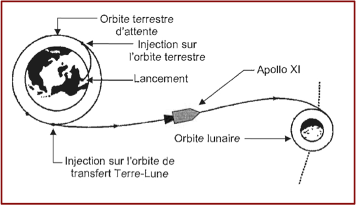
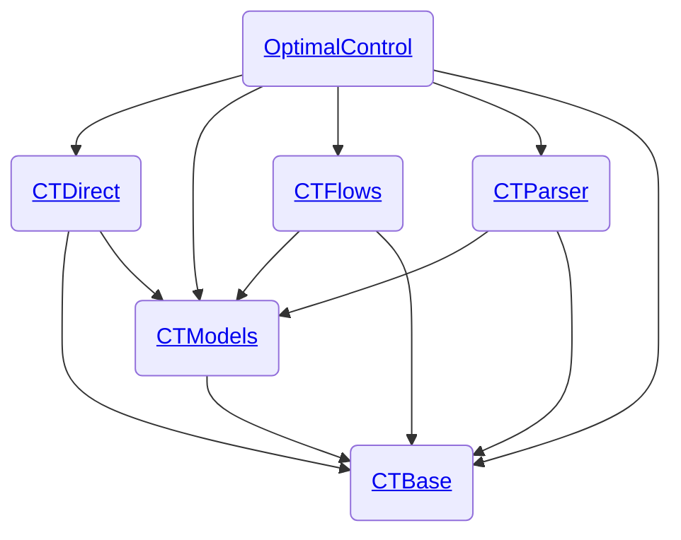

# L’écosystème Julia *control-toolbox* pour le contrôle optimal
_[Olivier Cots](https://github.com/ocots) – CNRS, Toulouse INP, IRIT_

En collaboration avec 
[Jean-Baptiste Caillau](http://caillau.perso.math.cnrs.fr), 
[Joseph Gergaud](https://github.com/joseph-gergaud), 
[Pierre Martinon](https://github.com/PierreMartinon), 
[Sophia Sed](https://sed-sam-blog.gitlabpages.inria.fr).

### Abstract

Le projet 
<a href="https://github.com/control-toolbox" style="display:inline-flex; align-items:center;">
  
  control-toolbox
</a> rassemble plusieurs packages 
<a href="https://julialang.org" style="display:inline-flex; align-items:center;">
  
  Julia
</a> conçus pour modéliser et résoudre des problèmes de contrôle optimal. Autour du package central **OptimalControl.jl**, il propose une architecture modulaire et performante pour définir des systèmes, implémenter différents schémas numériques, et exécuter des calculs sur CPU et GPU.

## 1. Introduction

Le **contrôle optimal** (ou **commande optimale**) consiste à déterminer la trajectoire optimale d’un système dynamique soumis à des contraintes, en minimisant (ou maximisant) un critère donné. Cette discipline combine des outils de mathématiques appliquées, d’optimisation et de simulation numérique, et trouve des applications dans la robotique, l’aéronautique, la finance, l’énergie et bien d’autres secteurs industriels.  

<figure style="text-align: center;">
  
  <figcaption><em>Figure :</em> Illustration du transfert Terre–Lune de la mission <strong>Apollo XI</strong>.</figcaption>
</figure>

L’objectif ici est de présenter un **écosystème Julia** permettant de modéliser, résoudre et partager efficacement des problèmes de contrôle optimal. Julia, par sa vitesse, sa syntaxe expressive et son riche écosystème, offre un cadre idéal pour connecter formulation mathématique, simulation numérique et optimisation avancée.

## 2. Pourquoi Julia ? 🚀

Julia est un langage de haut niveau, rapide et dynamique, conçu pour le calcul scientifique et les applications numériques, idéal pour le contrôle optimal.

### ⚡ Performances de haut niveau

Grâce à sa compilation Just-In-Time (JIT), Julia combine syntaxe expressive et vitesse exceptionnelle. Cependant, pour que le compilateur puisse générer un code machine optimisé, il est essentiel que les fonctions soient **stables en type**. Cela signifie que le type de sortie d'une fonction doit dépendre uniquement des types de ses entrées, et non de leurs valeurs.

### ✍️ Syntaxe intuitive et expressive

Sa syntaxe claire, proche de Python et des notations mathématiques classiques, facilite la modélisation et la résolution. Julia permet également d’utiliser des **caractères Unicode** pour nommer des variables et fonctions, ce qui rend le code très proche des notations mathématiques :

```julia
f(x₁, x₂) = x₁^2 + 3x₂^2      # fonction quadratique
∇f(x₁, x₂) = [2x₁, 6x₂]       # gradient : ∇f = [∂f/∂x₁, ∂f/∂x₂]
∇f(1.0, 2.0)                  # retourne [2.0, 12.0]
```

### 🌐 Écosystème riche et spécialisé

Julia dispose d’un écosystème complet pour l'optimisation, le calcul scientifique en général, et le contrôle optimal en particulier :

- **🧮 Différentiation automatique et équations différentielles** :  
  - [ForwardDiff.jl](https://juliadiff.org/ForwardDiff.jl/stable) et [Zygote.jl](https://fluxml.ai/Zygote.jl/stable) pour calculer gradients, Jacobiennes et Hessiennes.  
  - [DifferentialEquations.jl](https://docs.sciml.ai/DiffEqDocs/stable) pour résoudre des équations différentielles ordinaires.

- **📊 Optimisation – solveurs et modeleurs** :  
  - [JuMP.jl](https://jump.dev/JuMP.jl/stable) pour formuler des problèmes linéaires, non linéaires, en nombre entiers.  
  - [JuliaSmoothOptimizers](https://jso.dev) pour modéliser, résoudre et analyser des problèmes d’optimisation.  
  - [MadNLP.jl](https://madnlp.github.io/MadNLP.jl/stable), solveur intérieur-point entièrement en Julia, avec support GPU.  
  - [ExaModels.jl](https://exanauts.github.io/ExaModels.jl/stable) compile ces modèles en code SIMD-friendly pour GPU, incluant la différentiation automatique et l’évaluation vectorisée.  
  - [ADNLPModels.jl](https://jso.dev/ADNLPModels.jl/stable) : modélisation rapide de problèmes non linéaires en Julia, avec différentiation automatique et compatibilité [NLPModels.jl](https://jso.dev/NLPModels.jl/stable).  

- **🟩 Calculs sur GPU** : l’ensemble permet d’exploiter le parallélisme SIMD naturel des OCPs, du modèle jusqu’au solveur.  
  - [CUDA.jl](https://cuda.juliagpu.org/stable) pour programmer les GPU NVIDIA à différents niveaux d’abstraction.  
  - [KernelAbstractions.jl](https://juliagpu.org/KernelAbstractions.jl/stable) pour écrire des kernels portables multi-backend GPU.  
  - [CUDSS.jl](https://juliagpu.org/CUDSS.jl/stable) pour résoudre efficacement des systèmes linéaires creux sur GPU.  

- **🖥️ Langage dédié** :  
  - [MLStyle.jl](https://thautwarm.github.io/MLStyle.jl/latest) et [Moshi.jl](https://thautwarm.github.io/Moshi.jl/latest) pour le pattern matching et la métaprogrammation, facilitant la construction de DSL personnalisés, pour une écriture des problèmes de contrôle optimal proche des mathématiques.

- **🏆 Avantages clés pour le contrôle optimal** :  
  - Modélisation intuitive avec DSL proches de la notation mathématique.  
  - Accélération GPU et parallélisme SIMD pour résoudre de très grands OCPs.  
  - Extensibilité et portabilité grâce à la métaprogrammation et aux abstractions haut-niveau.  
  - Intégration fluide avec la différentiation automatique et la gestion de la parcimonie.  


## 3. Panorama de *control-toolbox*

## 3. Panorama de *control-toolbox*

L’écosystème *control-toolbox* rassemble plusieurs packages Julia dédiés au contrôle mathématique et à ses applications.

Le package central, [**OptimalControl.jl**](https://github.com/control-toolbox/OptimalControl.jl), fournit un DSL pour modéliser et résoudre des problèmes de contrôle optimal définis par des équations différentielles ordinaires. Il prend en charge les méthodes directes et indirectes, et s’exécute aussi bien sur CPU que sur GPU.  

En complément, [**OptimalControlProblems.jl**](https://github.com/control-toolbox/OptimalControlProblems.jl) propose une collection de problèmes de contrôle optimal de référence, formulés en Julia. Chaque problème est disponible à la fois dans le DSL **OptimalControl** et dans **JuMP**, avec des versions discrétisées prêtes à être résolues avec le solveur de votre choix. Ce package est particulièrement utile pour le benchmarking et la comparaison de différentes stratégies de résolution.  

Les autres briques de l’écosystème sont plus internes, mais assurent une architecture modulaire, flexible et cohérente :  

- **[`CTBase.jl`](https://github.com/control-toolbox/CTBase.jl)** : regroupe les éléments fondamentaux les plus génériques de l’écosystème : exceptions, concept de description, et fonctions auxiliaires réutilisables.  
- **[`CTModels.jl`](https://github.com/control-toolbox/CTModels.jl)** : définit les types principaux pour les modèles de contrôle optimal (problèmes, solutions), ainsi que tous les outils pour les construire (`setter`, `builder`), les afficher (`print`, `plot`) et les interroger (`getter`).  
- **[`CTDirect.jl`](https://github.com/control-toolbox/CTDirect.jl)** : implémente la transcription directe des problèmes de contrôle optimal en problèmes de programmation non linéaire (NLP) et leur résolution.  
- **[`CTFlows.jl`](https://github.com/control-toolbox/CTFlows.jl)** : propose des intégrateurs pour les systèmes dynamiques, incluant des flots classiques, hamiltoniens, et issus de problèmes de contrôle optimal.  
- **[`CTParser.jl`](https://github.com/control-toolbox/CTParser.jl)** : fournit un parser pour définir un problème de contrôle optimal via une syntaxe abstraite, facilitant l’interfaçage avec d’autres outils.  

👉 L’ensemble de ces packages est disponible sur le dépôt [*control-toolbox*](https://github.com/orgs/control-toolbox/repositories?type=all). Le package principal est organisé ainsi : 

<div align="center">



</div>

## 4. Exemple minimal en Julia

### Formulations

L’exemple ci-dessous montre comment définir, avec `OptimalControl.jl`, un problème de contrôle optimal simple : un double intégrateur contrôlé en accélération, pour lequel on minimise l’énergie du contrôle afin de passer d’une configuration initiale à une configuration finale fixée.

<div style="display: flex; gap: 20px;">

<div style="flex: 1;">

**Formulation mathématique**

$$
\begin{aligned}
\min_{x(\cdot),\, u(\cdot)} \quad & \frac{1}{2} \int_0^1 u^2(t) \, \mathrm{d}t \\[2em]
\text{sous contraintes :} \quad & \\[0.3em]
& \dot{x}(t) = \begin{bmatrix} x_2(t) \\[0.2em] u(t) \end{bmatrix}, \\[2em]
& x(0) = \begin{bmatrix} -1 \\ 0 \end{bmatrix}, \quad
  x(1) = \begin{bmatrix} 0 \\ 0 \end{bmatrix}.
\end{aligned}
$$

</div>

<div style="flex: 1;">

**Formulation en Julia avec `OptimalControl.jl`**

```julia
using OptimalControl

ocp = @def begin
    t ∈ [0, 1], time
    x ∈ R², state
    u ∈ R, control

    x(0) == [-1, 0]
    x(1) == [0, 0]
    
    ẋ(t) == [x₂(t), u(t)]

    0.5∫( u(t)^2 ) → min
end
```

</div>

</div>


### Résolution et visualisation

```julia
using NLPModelsIpopt, Plots

sol = solve(ocp)
plot(sol)
```

👉 Démonstration complète (résolution + graphiques) dans la documentation : [Double intégrateur – résolution et visualisation](https://control-toolbox.org/OptimalControl.jl/stable/example-double-integrator-energy.html).


## 5. Architecture logicielle et bonnes pratiques
- Séparation claire entre modèles, algorithmes et interfaces.
- Intégration continue (CI), tests unitaires et benchmarks.
- Performance CPU/GPU grâce à l’AD et à la compilation Julia.
- Documentation et ouverture aux contributions.


## 6. Applications
- **Mécanique spatiale** : transferts orbitaux, trajectoires.
- **Imagerie** (exemple à choisir).
- Benchmarks classiques (pour validation et comparaison).


## 7. Perspectives
- Étendre l’écosystème (méthodes indirectes, nouvelles interfaces).
- Renforcer la communauté autour de *control-toolbox*.
- Vers un framework Julia de référence pour le contrôle optimal.


## 8. Ressources
- GitHub : [https://github.com/control-toolbox](https://github.com/control-toolbox)
- Documentation en ligne
- Contact : Olivier Cots

<!--
CSS style
-->
<style>
h1 { color: #4d64ae; }      /* bleu */
h2 { color: #ca3c32; }      /* rouge */
h3 { color: #399746; }      /* vert */
p, li { color: #1a1a1a; }   /* texte noir/gris foncé */
code { background-color: #F4F4F4; padding: 2px 4px; border-radius: 4px; }
</style>