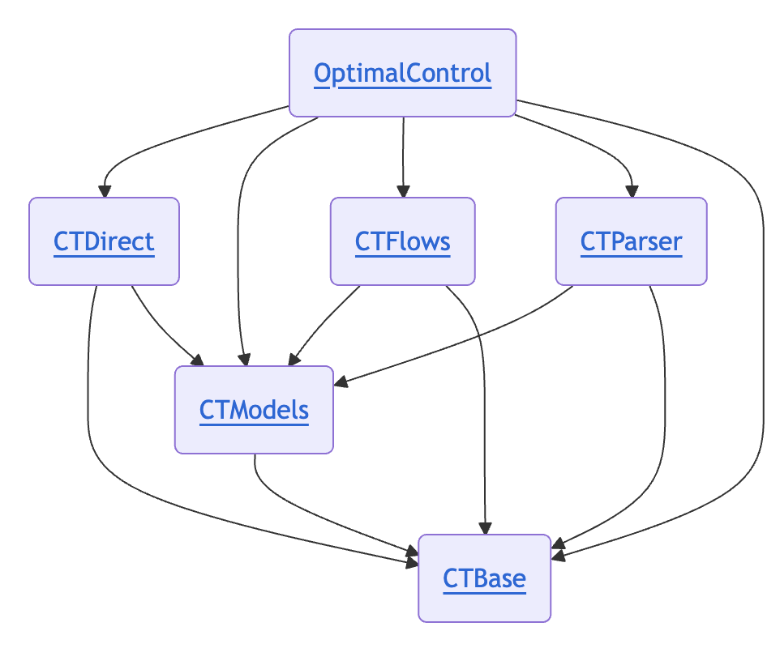

# L’écosystème Julia *control-toolbox* pour le contrôle optimal

_Olivier Cots – CNRS, Toulouse INP, IRIT_

Jean-Baptiste Caillau • Joseph Gergaud • Pierre Martinon • Sophia Sed

---

## Abstract

Le projet **control-toolbox** rassemble plusieurs packages Julia pour modéliser et résoudre des problèmes de contrôle optimal.  

- Package central : **OptimalControl.jl**  
- Architecture modulaire et performante  
- Calcul **CPU et GPU**  
- Connexion fluide entre :  
  - formulation mathématique,  
  - simulation,  
  - optimisation avancée

---

## 1. Introduction

- **Contrôle optimal** = trajectoire optimale d’un système sous contraintes  
- Domaine : math appliquées, optimisation, simulation numérique  
- Applications : robotique, aéronautique, finance, énergie  


<p class="caption">Transfert Terre–Lune – Mission Apollo XI</p>

---

## 2. Pourquoi Julia ? 🚀

Julia est un langage de haut niveau, rapide et dynamique, idéal pour le calcul scientifique et le contrôle optimal.

- **Performances** : compilation JIT et fonctions stables en type → code machine optimisé  
- **Syntaxe expressive** : proche des notations mathématiques, support Unicode  

```julia
f(x₁, x₂) = x₁^2 + 3x₂^2
∇f(x₁, x₂) = [2x₁, 6x₂]
∇f(1.0, 2.0)  # [2.0, 12.0]
```

---

### 🌐 Écosystème riche et spécialisé

- **Différentiation & EDOs** : ForwardDiff.jl, Zygote.jl, DifferentialEquations.jl  
- **Optimisation** : JuMP.jl, JuliaSmoothOptimizers, MadNLP.jl, ExaModels.jl, ADNLPModels.jl  
- **GPU** : CUDA.jl, KernelAbstractions.jl, CUDSS.jl  
- **Langage dédié** : MLStyle.jl, Moshi.jl pour DSL proches des mathématiques  

**Avantages clés** : modélisation intuitive, parallélisme SIMD/GPU, extensibilité, intégration différentiation automatique

---

## 3. Panorama de *control-toolbox*

### Packages principaux

- **OptimalControl.jl** : DSL pour modéliser et résoudre des OCPs (directes/indirectes, CPU/GPU)  
- **OptimalControlProblems.jl** : bibliothèque de problèmes de référence, prête pour benchmarking et comparaisons  

---

### Briques internes clés et architecture

<table style="width:100%;">
<tr>
<td style="width:50%; vertical-align:top;">

- **CTBase.jl** : éléments fondamentaux, exceptions, fonctions utilitaires  
- **CTModels.jl** : types de modèles et solutions, outils de construction et visualisation  
- **CTDirect.jl** : transcription directe en NLP et résolution  
- **CTFlows.jl** : intégrateurs pour systèmes dynamiques  
- **CTParser.jl** : parser DSL pour interface flexible  

</td>
<td style="width:50%; text-align:center; vertical-align:top;">


<p class="caption">💡 Architecture modulaire et cohérente, facilitant extension et intégration des packages</p>

</td>
</tr>
</table>
