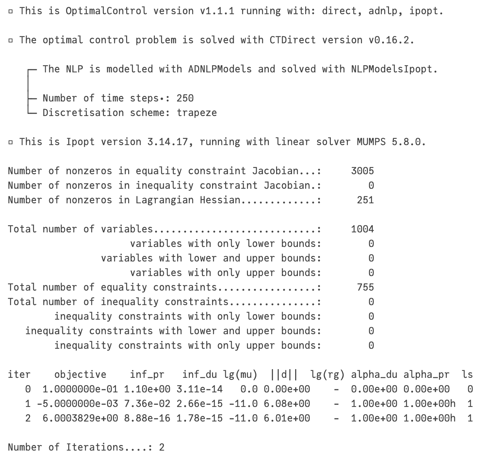
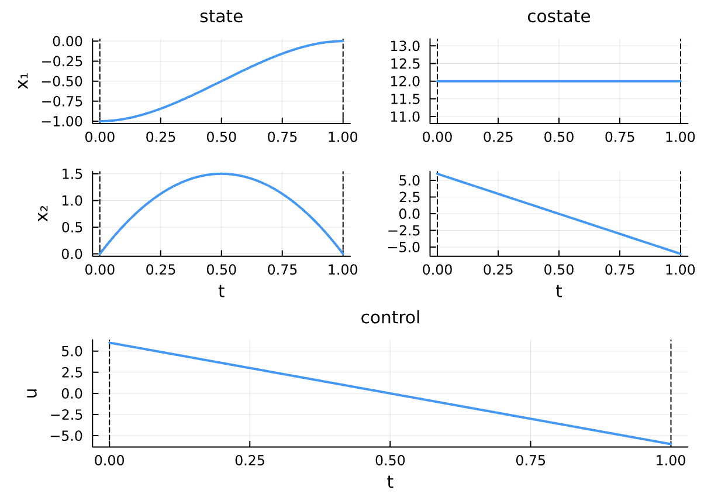
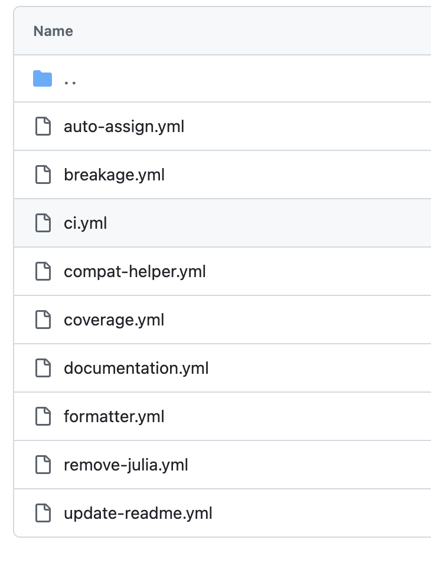
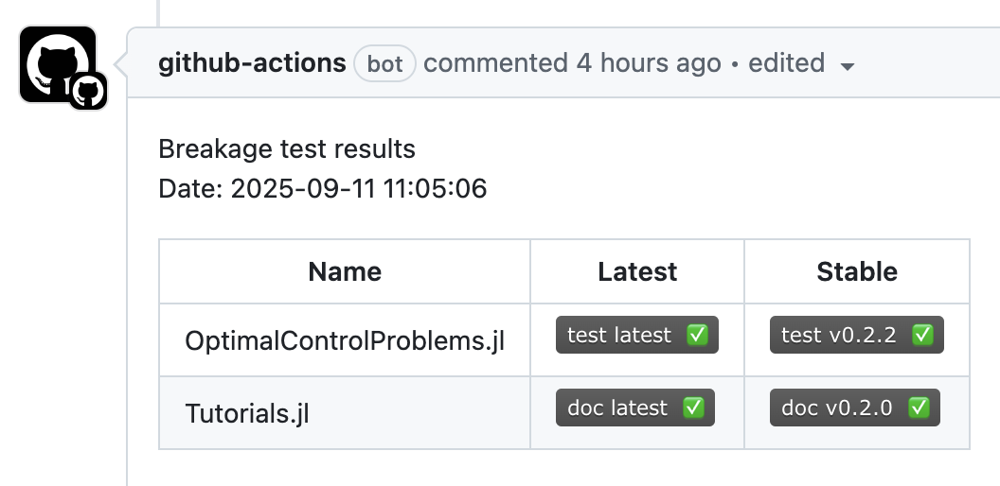
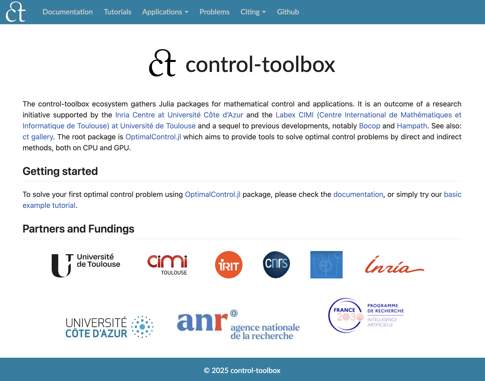

<!-- _class: title -->

# L’écosystème Julia *control-toolbox* pour le contrôle optimal

*Olivier Cots – CNRS, Toulouse INP, IRIT*

*Jean-Baptiste Caillau • Joseph Gergaud • Pierre Martinon • Sophia Sed*

---

## Contexte

Le projet **control-toolbox** rassemble plusieurs packages Julia pour modéliser et résoudre des problèmes de contrôle optimal.  

- Package central : **OptimalControl.jl**  
- Architecture modulaire et performante  
- Calcul **CPU et GPU**  
- Connexion fluide entre :  
  - formulation mathématique,  
  - simulation,  
  - optimisation avancée

---

## 1. Introduction

- **Contrôle optimal** = trajectoire optimale d’un système sous contraintes  
- Domaine : math appliquées, optimisation, simulation numérique  
- Applications : robotique, aéronautique, finance, énergie  

<div>

<p class="caption">Transfert Terre–Lune – Mission Apollo XI</p>
</div>

---

## 2. Pourquoi Julia ?

Julia est un langage de haut niveau, rapide et dynamique, idéal pour le calcul scientifique et le contrôle optimal.

- **Performances** : compilation JIT et fonctions stables en type → code machine optimisé  
- **Syntaxe expressive** : proche des notations mathématiques, support Unicode  

<div class="custom-columns">
<div class="column">

```julia
julia> f(x₁, x₂) = x₁^2 + 3x₂^2

julia> ∇f(x₁, x₂) = [
  2x₁, 
  6x₂
]

julia> ∇f(1.0, 2.0)
2-element Vector{Float64}:
  2.0
 12.0
```

</div>
<div class="column">

### 🌐 Écosystème riche et spécialisé

<style>
.column h3:first-child {
    margin-top: -0.1em;
}
</style>

- **AD & EDO** : ForwardDiff.jl, Zygote.jl, DifferentialEquations.jl  
- **Optimisation** : JuMP.jl, JuliaSmoothOptimizers, MadNLP.jl, ExaModels.jl, ADNLPModels.jl  
- **GPU** : CUDA.jl, KernelAbstractions.jl, CUDSS.jl  
- **DSL** : MLStyle.jl, Moshi.jl pour le pattern matching

</div>
</div>

**Avantages clés** : modélisation intuitive, parallélisme SIMD/GPU, extensibilité, différentiation automatique...

---

## 3. Panorama de *control-toolbox*

### Packages principaux

- **OptimalControl.jl** : DSL pour modéliser et résoudre des OCPs (directes/indirectes, CPU/GPU)  
- **OptimalControlProblems.jl** : bibliothèque de problèmes de référence, prête pour benchmarking et comparaisons  

<div class="columns">
<div class="column">

### Briques internes clés et architecture

- **CTBase.jl** : exceptions, fonctions utilitaires
- **CTModels.jl** : types des modèles, solutions, setters, getters et visualisation  
- **CTDirect.jl** : discrétisation et résolution  
- **CTFlows.jl** : systèmes hamiltoniens et flots
- **CTParser.jl** : définition abstraite et parser

</div>

<style>
.column .diagramme {
    margin-top: -2.0em;
}
</style>
<div class="column">

<p class="caption">💡 Architecture modulaire et cohérente</p>
</div>
</div>

---

## 4. Exemple minimaliste : double intégrateur

**Problème** : Trouver le contrôle optimal pour amener un système de la position $(-1, 0)$ à $(0, 0)$ en minimisant l'énergie du contrôle.

<div class="columns">
<div class="column">

**Formulation mathématique**

$$
\begin{aligned}
\min_{x(\cdot),\, u(\cdot)} \quad & \frac{1}{2} \int_0^1 u^2(t)\,\mathrm{d}t \\[1em]
\text{s.c. :} \quad &
\dot{x}(t) = \begin{bmatrix} x_2(t) \\ u(t) \end{bmatrix}, \\[1em]
& x(0) = \begin{bmatrix} -1 \\ 0 \end{bmatrix}, \quad
x(1) = \begin{bmatrix} 0 \\ 0 \end{bmatrix}.
\end{aligned}
$$

</div>
<div class="column">

**Avec OptimalControl.jl**

```julia
using OptimalControl

ocp = @def begin
    t ∈ [0, 1], time
    x ∈ R², state
    u ∈ R, control

    x(0) == [-1, 0]
    x(1) == [0, 0]

    ẋ(t) == [x₂(t), u(t)]

    0.5∫(u(t)^2) → min
end
```

</div>
</div>

---

### Résolution et visualisation

<div class="columns">
<div class="column">

**Résolution**

```julia
using NLPModelsIpopt
sol = solve(ocp)
```



</div>

<div class="column">

**Visualisation**

```julia
using Plots
plot(sol)
```



</div>
</div>

---

## 5. Architecture logicielle et bonnes pratiques

### 🏗️ Séparation des responsabilités

- **Modèles** : définition, manipulation et visualisation  
- **Algorithmes** : méthodes de transcription, intégrateurs  
- **Interfaces** : DSL proche des mathématiques  

### ⚡ Performance

- **Différentiation automatique** et compilation Julia  
- **Structure creuse** des problèmes discrétisés  
- Support natif **CPU et GPU** pour le calcul haute performance  

---

### 🔄 Qualité logicielle

- **Intégration continue** : tests, couverture, documentation  
- **Tests unitaires** : modèles, solveurs, API  
- **Benchmarks** : suivi des performances  
- **Détection d'incompatibilités** avec les dépendances  

<div class="columns">
<div class="column">

**Actions CI/CD**



</div>
<div class="column">

**Détection d'incompatibilités**



</div>
</div>

<p class="caption">💡 Automatisation et surveillance de la qualité</p>

---

### 📖 Ouverture et communauté

- Documentation complète sur [control-toolbox.org](https://control-toolbox.org) : Manuels pour [OptimalControl.jl](https://control-toolbox.org/OptimalControl.jl/stable), [Tutoriels](https://control-toolbox.org/Tutorials.jl/stable) avancés, Catalogue de [problèmes modélisés](https://control-toolbox.org/OptimalControlProblems.jl/stable).

- Applications phares de la communauté :
  - [PWL models of gene regulatory networks](https://agustinyabo.github.io/PWLdynamics.jl/stable) (+ [Binder](https://mybinder.org/v2/gh/agustinyabo/PWLdynamics.jl/main))
  - [Loss control regions in optimal control problems](https://control-toolbox.org/LossControl.jl/stable)
  - [Optimal control in Medical Resonance Imaging](https://control-toolbox.org/MedicalResonanceImaging.jl/stable)
  - [Minimum time orbit transfer](https://control-toolbox.org/Kepler.jl/stable)

<div class="columns" style="margin-top: 20px;">
<div class="column">

**Reproductibilité**


</div>
<div class="column">

**Communauté active**

- Issues et discussions GitHub
- Contributions bienvenues
- Environnements reproductibles

</div>
</div>

---

## Conclusion & Perspectives

### Principaux atouts

- **Unifié** : Approche unifiée pour les méthodes directes et indirectes  
- **Modulaire** : Architecture flexible et extensible  
- **Performant** : Exploitation des capacités de Julia  
- **Communautaire** : Documentation complète et écosystème en croissance  

### Prochaines étapes

- Extension de l'écosystème : Méthodes indirectes, Méthodes homotopiques  
- Renforcement de la communauté : applications, tutoriels, algorithmes...

---

### Ressources

- 📚 Documentation : [control-toolbox.org](https://control-toolbox.org)  
- 💻 Code source : [github.com/control-toolbox](https://github.com/control-toolbox)  
- 📧 Contact : Olivier Cots, [olivier.cots@irit.fr](mailto:olivier.cots@irit.fr)

<div>
  
</div>

<style>
.presentation-logo {
    max-width: 85%;
    height: auto;
    margin: 10px auto;
    display: block;
}
</style>
